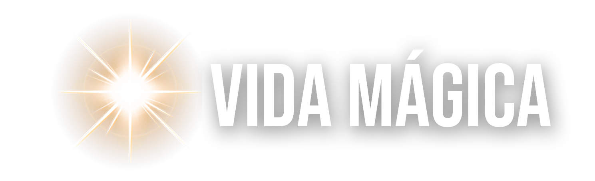

# Vida Mágica Design System

## Company/Product Context

**Vida Mágica** is a Brazilian spiritual transformation and personal development brand founded by Suellen Seragi (alongside Renato). The brand focuses on mental reprogramming, law of attraction, biblical prosperity, and spiritual awakening for modern audiences seeking divine connection and personal transformation.

### Core Mission
Vida Mágica helps people transform their lives through spiritual practices, mental reprogramming, and prosperity consciousness. The brand combines elements of faith, personal development, and the law of attraction in an approachable, premium, and contemporary way.

### Products & Offerings
The brand offers multiple products and programs:
- **Clube Vida Mágica** — Membership community
- **Mágica do Fluir** — Pocket guide for flow and transformation
- **Sessão de Diagnóstico** — Diagnostic prosperity sessions
- **Teste de Prosperidade** — Prosperity assessment
- **Guia Prático** — Practical guides
- **LDA Bíblica** — Biblical law of attraction content
- **Série Despertando Prosperidade Bíblica** — Biblical prosperity awakening series
- **Ouro da Reprogramação** — Mental reprogramming gold program
- **Vencendo o Medo** — Overcoming fear program
- **A Tal Maneira** — Courses and books

### Brand Essence
- **Spiritual but not traditionally religious** — Modern spiritual approach
- **Premium and aspirational** — Luxurious, high-value positioning
- **Warm and welcoming** — Approachable, empathetic, human
- **Transformational** — Focused on deep personal change
- **Divine connection** — Ethereal, magical, connected to higher purpose

### Visual Identity
The brand's visual language centers on **golden warmth, bokeh light particles, ethereal glow, and butterfly symbolism**. The iconic blue morpho butterflies represent transformation and metamorphosis — a core metaphor for the brand's promise of personal evolution.

### Sources
- **GitHub Repository**: renatoambrosi/vidamagica (product images, background theme, reference materials)
- **Uploaded Assets**: Logo files (horizontal/vertical), favicon
- **Product Portfolio**: 11 product cover images showcasing the brand's visual system

---

## Design System Contents

This design system contains:
- **README.md** — This file; overview and context
- **colors_and_type.css** — Complete color palette and typography system
- **assets/** — Logos, backgrounds, product imagery, and visual motifs
- **fonts/** — Web fonts (if available)
- **preview/** — Visual specimen cards for the Design System tab
- **ui_kits/** — High-fidelity component libraries (if applicable)
- **slides/** — Branded slide templates (if applicable)
- **SKILL.md** — Agent skill definition for reuse

---

## CONTENT FUNDAMENTALS

### Tone & Voice
Vida Mágica speaks with a voice that is:
- **Empowering and uplifting** — "Você merece viver a vida que sonha" (You deserve to live the life you dream)
- **Intimate and personal** — Uses "você" (informal you), creating warmth and directness
- **Transformational** — Language focused on change, awakening, flow, reprogramming
- **Spiritual but accessible** — Combines biblical references with modern mindset work
- **Aspirational yet grounded** — Speaks of magic and miracles while providing practical tools

### Writing Style
**Portuguese Language**: All content is in Brazilian Portuguese.

**Personal pronouns**: Second person "você" (you) to create intimacy; first person "eu" in testimonials and personal stories.

**Sentence structure**: Mix of short, punchy statements and longer inspirational phrases. Questions are used to engage and provoke reflection.

**Capitalization**: 
- Product names use title case or all caps for emphasis: "VIDA MÁGICA", "Clube Vida Mágica"
- Headings often use ALL CAPS for impact and authority
- Body text uses standard sentence case

**Punctuation**: Standard Portuguese conventions. Exclamation marks used sparingly for genuine excitement.

### Key Themes & Language
**Transformation vocabulary**: despertar (awaken), transformar (transform), fluir (flow), reprogramar (reprogram), mudar (change), vencer (overcome)

**Spiritual/Divine terms**: Deus (God), fé (faith), divino (divine), prosperidade (prosperity), bíblica (biblical), mágica (magic)

**Emotional states**: medo (fear), ansiedade (anxiety), paz (peace), abundância (abundance), gratidão (gratitude)

**Biblical + Law of Attraction blend**: The brand uniquely combines biblical prosperity teachings with law of attraction principles, creating phrases like "prosperidade bíblica" and "Lei da Atração Bíblica".

### Copy Examples from Materials
- "Um dia, eu estava tão cansada da vida que levava, que resolvi tentar a única coisa que parecia fazer menos sentido: Mudar minha mente."
- "Foi aí que DESPERTEI e mudei minha realidade completamente."
- "CLUBE VIDA MÁGICA"
- "Guia de Bolso MÁGICA DO FLUIR"
- "TESTE DE PROSPERIDADE — Renato e Suellen Seragi — SESSÃO DE DIAGNÓSTICO"

### Emoji Usage
**Butterflies are used as visual symbols** rather than emoji. No emoji observed in the brand materials — the brand relies on photography, illustrated elements, and typography for visual interest.

---

## VISUAL FOUNDATIONS

### Color Philosophy
The Vida Mágica palette is built around **warm golden light** — representing divine illumination, prosperity, and transformation. The gold-to-pearl gradient creates an ethereal, heavenly atmosphere that feels both luxurious and spiritually uplifting.

**Primary Palette**: 
- **Gold Amber (#C8922A)** — The hero color; used for primary actions, key text accents, and the iconic starburst logo
- **Gold Light (#E8C97A)** — For softer highlights, borders, and secondary emphasis
- **Pearl White (#F5F0E8)** — Base light color for backgrounds and text overlays
- **Brown Dark (#1A1205)** — Deep contrast for typography and dark backgrounds

**Accent Palette**:
- **Blue Butterfly (#1E8FD5)** — The signature morpho blue, used sparingly for the butterfly motif and special accents

### Background Treatments
**Signature background**: The brand's hero background is a warm golden gradient (amber to pearl white center) with:
- **Bokeh light particles** — Scattered glowing orbs creating magical atmosphere
- **Soft gaussian blur** — Dreamy, ethereal depth
- **Radial glow from center** — Divine light source radiating outward
- **Blue morpho butterflies** — Positioned in lower right corner as transformation symbol

**Variations**:
- **Full bokeh gold** — All-over golden warmth with particles (most common)
- **Gradient overlays** — Darker gradient at edges, lighter in center to focus attention
- **Product-specific palettes** — Some products use cooler tones (purple/mauve for diagnostic, greenish-gold for prosperity)
- **Dark backgrounds** — Deep brown/black for contrast with gold text and glowing elements

### Typography Patterns
**Display Type** (Montserrat or similar sans-serif):
- **ALL CAPS for primary headings** — Creates authority and impact
- **Extra bold to black weights** — Maximum presence and confidence
- **Tight letter-spacing** — Condensed for power
- **White text with subtle shadow/glow** — Ensures readability over complex backgrounds

**Script/Cursive** (Allura or similar):
- **Used for names** — "Suellen Seragi" always in elegant script
- **Accent phrases** — Soft, feminine counterpoint to bold display type
- **Gold or white color** — Never dark; always ethereal

**Body Type** (Open Sans or similar):
- **Regular to medium weights** — Readable and warm
- **Generous line-height** — Easy to read, inviting
- **Light text over dark, dark over light** — Always high contrast

### Layout & Composition
**Centering & Symmetry**: Most compositions are center-aligned with radial symmetry, echoing the starburst logo and divine light concept.

**Hierarchy through scale**: Massive type for product names, smaller script for attribution, minimal body copy.

**Breathing room**: Generous negative space allows the magical backgrounds to shine.

**Overlay text boxes**: When text needs more readability, it's placed in subtle rounded rectangles with semi-transparent backgrounds.

### Imagery & Visual Motifs
**Photography**:
- **Founder portraits** — Warm, approachable, natural lighting; Suellen often positioned with hand to chin in thoughtful pose
- **Product imagery** — Generated/illustrated covers with consistent brand aesthetic
- **Color temperature** — Always warm; no cool/clinical tones

**Illustrated Elements**:
- **Starburst/Light rays** — The iconic logo motif; radiating light symbolizing divine illumination
- **Butterflies** — Blue morpho butterflies (realistic or stylized); always in small clusters, never singular
- **Bokeh particles** — Varying sizes of soft circular light spots
- **Golden textures** — Subtle sparkle, glow, and ethereal light effects

**3D Rendered Objects** (in some product covers):
- **Magnifying glass** — For diagnostic/discovery themes
- **Puzzle pieces** — For problem-solving and clarity
- **Golden rings/circles** — For completion and wholeness
- High-quality realistic rendering with soft lighting

### Border & Frame Treatments
**Product covers**: Often use colored border frames (gold, blue, orange) with rounded corners to contain the composition and create visual consistency across the product line.

**No hard geometric grids**: The brand avoids rigid structure; layouts feel organic and flowing.

### Shadows & Depth
**Text shadows**: White text almost always has dark shadows for legibility; gold text has subtle glows.

**Drop shadows**: Soft, diffused shadows on text blocks and overlay elements — never harsh.

**Glow effects**: Gold elements often have outer glow (box-shadow with blur and spread) to create luminosity.

### Interactive States (Inferred)
Since no interactive UI was provided, standard assumptions:
- **Hover**: Darken gold from #C8922A to #A17523; subtle glow increase
- **Active/Press**: Further darken to #7A5818; slight scale down
- **Disabled**: Desaturate to beige (#D9CFC0)

### Animation & Motion (Inferred)
Based on the ethereal aesthetic:
- **Easing**: Smooth, gentle curves (ease-in-out); no harsh snaps
- **Fades**: Soft opacity transitions
- **Floating particles**: Subtle drift and scale animations for bokeh
- **Glow pulses**: Slow breathing effect on key elements
- **No rapid movements**: Everything feels calm, meditative, divine

### Spacing & Rhythm
**Generous padding**: Elements never feel cramped; lots of air around text and images.

**Vertical rhythm**: Strong vertical flow with clear section breaks.

**Minimal density**: Prefer fewer, larger elements over crowded layouts.

### Corner Radii
**Moderate rounding** — 8-16px for most elements; creates softness without being overly playful.

**Product frames** — 12-20px for cover frames and content cards.

### Use of Transparency & Blur
**Frequent frosted glass effects**: Semi-transparent overlays with backdrop blur for text containers.

**Layered depth**: Background, mid-ground particles, foreground text — clear z-axis hierarchy.

---

## Design System Index

### Core Files
- **README.md** — This file; complete brand context and design guidelines
- **colors_and_type.css** — Complete CSS custom properties for colors, typography, spacing, shadows, and radii
- **SKILL.md** — Agent skill definition for cross-project reuse

### Visual Assets (`/assets`)
- **Logos**: `logo-horizontal.png`, `logo-vertical.png`, `favicon.png`
- **Backgrounds**: `background-theme.jpg` (signature golden bokeh with butterflies)
- **Brand Elements**: `butterfly-blue.png`, `suellen-hero.jpg`
- **Product Library** (`/assets/products`): 11 product cover images showcasing brand aesthetic

### Preview Cards (`/preview`)
Interactive specimens visible in the Design System tab:
- **Colors**: Primary palette, semantic tokens
- **Typography**: Display (Montserrat), body (Open Sans), script (Allura)
- **Brand**: Logos, background theme, visual motifs
- **Spacing**: Scale, shadows, border radii
- **Components**: Button variants

### Font Stack
**Display**: Montserrat (Black, ExtraBold, Bold) — Available via Google Fonts  
**Body**: Open Sans (Light, Regular, Medium, SemiBold, Bold, ExtraBold) — **Custom font files included in `/fonts`**  
**Script**: Allura (Regular) — Available via Google Fonts

**Note**: The design system now includes 35 Open Sans font files (regular, condensed, and semi-condensed variants with full weight + italic coverage). These are self-hosted and declared in `colors_and_type.css` via @font-face. Montserrat and Allura remain on Google Fonts.

### UI Kits
**None created** — The provided repository contains only brand assets and product imagery, no interactive UI/website code to recreate. If you need UI components for a specific Vida Mágica digital product (website, app, landing pages), please provide:
- Repository with the actual codebase, or
- Figma designs with components, or
- Screenshots of the live product

The design system is ready to create **new** branded assets (slides, landing pages, prototypes) but cannot recreate existing UIs without source materials.

### Usage
Import `colors_and_type.css` into any HTML project:
```html
<link rel="stylesheet" href="colors_and_type.css">
```

Reference assets using relative paths:
```html

```

Apply semantic classes:
```html
<h1 class="h1">VIDA MÁGICA</h1>
<p class="body">Transforme sua realidade...</p>
<button class="btn btn-primary">Começar</button>
```

---

*Design system complete. Ready for brand-aligned asset creation.*
